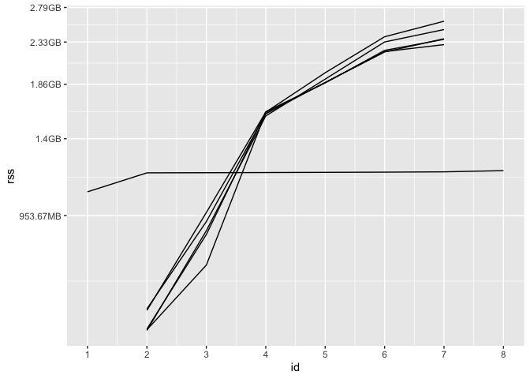

<!-- README.md is generated from README.Rmd. Please edit that file -->

# syrup

<!-- badges: start -->

[](https://lifecycle.r-lib.org/articles/stages.html#experimental)
[](https://CRAN.R-project.org/package=syrup)
[](https://github.com/simonpcouch/syrup/actions/workflows/R-CMD-check.yaml)
<!-- badges: end -->

The goal of syrup is to coarsely measure memory usage of R code run in
parallel by regularly taking snapshots of calls to the system command
`ps`. The package name is an homage to syrupy (**SY**stem **R**esource
**U**sage **P**rofile …um, **Y**eah), a Python tool at
[jeetsukumaran/Syrupy](https://github.com/jeetsukumaran/Syrupy). **This
package is highly experimental and results ought to be interpreted with
caution.**

## Installation

You can install the development version of syrup like so:

``` r
pak::pak("simonpcouch/syrup")
```

## Example

We’ll demo using the package with an (admittedly dependency-heavy)
example of tuning a regularized linear model against resamples. First,
loading needed packages:

``` r
library(syrup)
library(future)
library(tidymodels)
library(rlang)
```

Using future to define our parallelism strategy, we’ll set
`plan(multicore)`, indicating that we’d like to use forking with 5
workers. By default, future disables forking from RStudio; I know that,
in the context of building this README, this usage of forking is safe,
so I’ll temporarily override that default with `parallelly.fork.enable`.

``` r
local_options(parallelly.fork.enable = TRUE)
plan(multicore, workers = 5)
```

Now, simulating some data:

``` r
set.seed(1)
dat <- sim_regression(1000000)

dat
#> # A tibble: 1,000,000 × 21
#>    outcome predictor_01 predictor_02 predictor_03 predictor_04 predictor_05
#>      <dbl>        <dbl>        <dbl>        <dbl>        <dbl>        <dbl>
#>  1    3.63       -1.88        0.872       -0.799       -0.0379       2.68  
#>  2   41.6         0.551      -2.47         2.37         3.90         5.18  
#>  3   -6.99       -2.51       -3.15         2.61         2.13         3.08  
#>  4   33.2         4.79        1.86        -2.37         4.27        -3.59  
#>  5   34.3         0.989      -0.315        3.08         2.56        -5.91  
#>  6   26.7        -2.46       -0.459        1.75        -5.24         5.04  
#>  7   21.4         1.46       -0.674       -0.894       -3.91        -3.38  
#>  8   21.7         2.21        1.28        -1.05        -0.561        2.99  
#>  9   -8.84        1.73        0.0725       0.0976       5.40         4.30  
#> 10   24.5        -0.916      -0.223       -0.561       -4.12         0.0508
#> # ℹ 999,990 more rows
#> # ℹ 15 more variables: predictor_06 <dbl>, predictor_07 <dbl>,
#> #   predictor_08 <dbl>, predictor_09 <dbl>, predictor_10 <dbl>,
#> #   predictor_11 <dbl>, predictor_12 <dbl>, predictor_13 <dbl>,
#> #   predictor_14 <dbl>, predictor_15 <dbl>, predictor_16 <dbl>,
#> #   predictor_17 <dbl>, predictor_18 <dbl>, predictor_19 <dbl>,
#> #   predictor_20 <dbl>
```

The main function in the syrup package, `syrup()`, takes an expression
as argument:

``` r
res_mem <- syrup({
  res <-
    tune_grid(
      linear_reg(engine = "glmnet", penalty = tune()),
      outcome ~ .,
      vfold_cv(dat)
    )
})
```

The function works by:

- Setting up another R process `sesh` that queries system information at
  a regular interval,
- Evaluating the supplied expression,
- Reading the queried system information back into the main process from
  `sesh`,
- Closing `sesh`, and then
- Returning the queried system information.

The output is a tibble:

``` r
res_mem
#> # A tibble: 60 × 6
#>       id   pid  ppid name                 rss       vms
#>    <dbl> <int> <int> <chr>          <bch:byt> <bch:byt>
#>  1     1 58494 58354 rsession-arm64  542.34MB     393GB
#>  2     1 59643 58494 R                 1.08GB     393GB
#>  3     2 58494 58354 rsession-arm64  542.34MB     393GB
#>  4     2 59643 58494 R                 1.23GB     393GB
#>  5     2 59660 59643 R               526.48MB     393GB
#>  6     2 59661 59643 R               489.86MB     393GB
#>  7     2 59662 59643 R                403.3MB     393GB
#>  8     2 59663 59643 R               327.42MB     393GB
#>  9     2 59664 59643 R               179.06MB     393GB
#> 10     3 58494 58354 rsession-arm64  542.34MB     393GB
#> # ℹ 50 more rows
```

In this tibble, `id` defines a specific time point at which process
usage was snapshotted, and the remaining columns show output from
[ps::ps()](https://ps.r-lib.org/reference/ps.html). Notably, `pid` is
the process ID, `ppid` is the process ID of the parent process, and
`rss` is the resident set size (a measure of memory usage).

We can plot to get a better sense of how memory usage of these processes
changes over time.

``` r
worker_ppid <- names(sort(-table(res_mem$ppid)))[1]

res_mem %>%
  filter(ppid == worker_ppid | pid == worker_ppid) %>%
  ggplot() +
  aes(x = id, y = rss, group = pid) +
  geom_line() +
  scale_x_continuous(breaks = 1:max(res_mem$id))
```



At first, only the parent process has non-`NA` `rss`, as tidymodels
hasn’t sent data off to any workers yet. Then, each of the 5 workers
receives data from tidymodels and begins fitting models. Eventually,
each of those workers returns their results to the parent process, and
their `rss` is once again `NA`. The parent process wraps up its
computations before completing evaluation of the expression, at which
point `syrup()` returns.

Note that memory is weird; in the above plot, the total memory allotted
to the parent session and its five workers at each ID is not simply the
sum of those `rss` values, as memory is shared among them.

## Scope

There’s nothing specific about this package that necessitates the
expression provided to `syrup()` is run in parallel. Said another way,
syrup will work just fine with “normal,” sequentially-run R code. That
said, there are many better, more fine-grained tools for the job in the
case of sequential R code, such as `Rprofmem()`, the
[profmem](https://cran.r-project.org/web/packages/profmem/vignettes/profmem.html)
package, the [bench](https://bench.r-lib.org/) package, and packages in
the [R-prof](https://github.com/r-prof) GitHub organization.

Results from syrup only provide enough detail for the coarsest analyses
of memory usage, but they do provide an entry to “profiling” memory
usage for R code that runs in parallel.
